# Architecture

How `sae-j1939-rs` is put together, and why.

This document describes the code as it exists, not a plan. Every behaviour
below is taken from the source in `core/src` and `host/src`; where the reason
for a decision is written into a doc comment, this document quotes or
paraphrases it rather than inventing a new one.

If you are looking for *how to use* the crates, read [`README.md`](README.md)
first. This is the layer underneath: what each module owns, what it deliberately
does not own, and where the boundaries fall.

## Contents

1. [System overview](#1-system-overview)
2. [Layering against the J1939 standard parts](#2-layering-against-the-j1939-standard-parts)
3. [The 29-bit identifier and the PDU1/PDU2 split](#3-the-29-bit-identifier-and-the-pdu1pdu2-split)
4. [Receive data flow](#4-receive-data-flow)
5. [Transmit data flow](#5-transmit-data-flow)
6. [Transport protocol sequences](#6-transport-protocol-sequences)
7. [Address claiming state machine](#7-address-claiming-state-machine)
8. [Reassembler session model](#8-reassembler-session-model)
9. [Diagnostic fault lifecycle](#9-diagnostic-fault-lifecycle)
10. [Memory model](#10-memory-model)
11. [Sans-I/O design rationale](#11-sans-io-design-rationale)
12. [Error handling](#12-error-handling)
13. [Testing strategy](#13-testing-strategy)

---

## 1. System overview

The workspace is two crates, split on exactly one line: whether the code needs
an operating system.

| Crate | Directory | Environment | Owns |
|-------|-----------|-------------|------|
| `sae-j1939-rs` | `core/` | `#![no_std]`, `#![deny(unsafe_code)]`, allocation-free | Every protocol rule |
| `sae-j1939-host` | `host/` | `std` | A clock, a socket, and blocking convenience |

The core has one dependency, `embedded-can`, and it is used only for the
`can` bridge module. The core's own `Frame`, `Id`, `Node` and `Reassembler`
types do not mention it. `heapless` appears only as a dev-dependency, for a
mock frame in the `can` tests — the library itself is plain arrays.

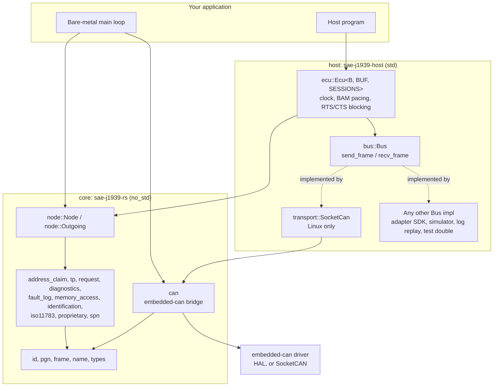
```mermaid
flowchart TB
    subgraph app["Your application"]
        mcuapp["Bare-metal main loop"]
        hostapp["Host program"]
    end

    subgraph host["host: sae-j1939-host (std)"]
        ecu["ecu::Ecu&lt;B, BUF, SESSIONS&gt;<br/>clock, BAM pacing, RTS/CTS blocking"]
        bustrait["bus::Bus<br/>send_frame / recv_frame"]
        socketcan["transport::SocketCan<br/>Linux only"]
        other["Any other Bus impl<br/>adapter SDK, simulator, log replay, test double"]
    end

    subgraph core["core: sae-j1939-rs (no_std)"]
        node["node::Node / node::Outgoing"]
        proto["address_claim, tp, request, diagnostics,<br/>fault_log, memory_access, identification,<br/>iso11783, proprietary, spn"]
        wire["id, pgn, frame, name, types"]
        canbridge["can<br/>embedded-can bridge"]
    end

    hal["embedded-can driver<br/>HAL, or SocketCAN"]

    mcuapp --> node
    mcuapp --> canbridge
    hostapp --> ecu
    ecu --> bustrait
    bustrait -.implemented by.-> socketcan
    bustrait -.implemented by.-> other
    socketcan --> canbridge
    ecu --> node
    node --> proto
    proto --> wire
    canbridge --> wire
    canbridge --> hal
```

**What runs where.** On a microcontroller you depend only on `sae-j1939-rs`.
`Node` is the whole stack; `can::frame_from`, `can::j1939_id`, `can::decode`
and `can::encode` bridge to whatever your HAL's `embedded-can` implementation
is. `core/examples/mcu_node.rs` is that main loop written out, with a counter
standing in for `SysTick` and a mock CAN peripheral — it needs `std` only to
print. On a host you depend on `sae-j1939-host`, which re-exports the core
(`pub use sae_j1939_rs;`) so a host application needs a single dependency.

**What the host crate adds, and only that.** `Ecu` supplies the two things
`Node` deliberately refuses to own: a clock (`Instant`/`Duration`) and a bus.
Everything else it does is a thin wrapper. `Ecu::poll` calls `Node::on_frame`
and `Node::tick`; `Ecu::broadcast` and `Ecu::send_to` drive `Outgoing`. The
protocol logic is not duplicated, which is the stated point of the split: there
is only ever one implementation of each rule to get right.

`transport::SocketCan` is compiled only on `target_os = "linux"`. `Ecu` is
not — it is generic over the `Bus` trait, so it builds and runs on macOS or
Windows against a simulator or a test double.

Note that `SocketCan` opens a plain `SOCK_RAW` CAN socket, not the Linux
kernel's `CAN_J1939` protocol family. The kernel module implements the
transport protocol itself; doing it in the core instead is what lets the same
code run on a microcontroller.

---

## 2. Layering against the J1939 standard parts

J1939 is a family of documents, not one specification. The module layout
follows it directly, so a module maps to a part you can look up.

| Module | Part | What it covers | Key public types |
|--------|------|----------------|------------------|
| `types` | — | Shared value types | `Address`, `Priority`, `Error`, `Result` |
| `id` | -21 | The 29-bit CAN identifier | `Id` |
| `pgn` | -21 | Parameter group numbers, PDU1/PDU2 normalisation, well-known constants | `Pgn` |
| `frame` | -21 | One CAN frame: an `Id` plus up to eight bytes | `Frame` |
| `tp` | -21 | Transport protocol, both directions | `TpCm`, `TpDt`, `Reassembler`, `Transmitter` |
| `request` | -21 | Request and Acknowledgement groups | `Request`, `Acknowledgement`, `AckControl` |
| `proprietary` | -21 | Proprietary A (PDU1) and Proprietary B (PDU2) addressing | `ProprietaryB` |
| `name` | -81 | The 64-bit ECU NAME | `Name` |
| `address_claim` | -81 | Claiming, defending, relocating, commanded address | `AddressClaimer`, `ClaimState`, `Claim`, `ClaimAction` |
| `diagnostics` | -73 | DM1/DM2 trouble codes and lamp status, DM3 clear | `Lamps`, `Dtc`, `Message`, `dm3` |
| `fault_log` | -73 | The fault state an ECU reports about *itself* | `FaultLog` |
| `memory_access` | -73 | DM14/DM15/DM16 memory read, write, data transfer | `Dm14`, `Dm15`, `Dm16` |
| `identification` | -71 | Software / ECU / component identification | `SoftwareIdentification`, `EcuIdentification`, `ComponentIdentification` |
| `spn` | -71 | Bit extraction, scaling, and the status ranges | `Spn`, `SpnValue`, `RawValue`, `catalogue` |
| `iso11783` | ISO 11783-7 | Auxiliary (×16) and general purpose valves | `ValveNumber`, `AuxiliaryValveCommand`, … |
| `can` | — | Bridge to the `embedded-can` traits | `frame_from`, `j1939_id`, `decode`, `encode` |
| `node` | — | The parts wired together | `Node`, `Outgoing`, `Event`, `Progress` |

The naming trap this layout avoids: `can` — not `transport` — holds the CAN
frame bridge, because in J1939 "transport protocol" means something specific,
and that is `tp`.

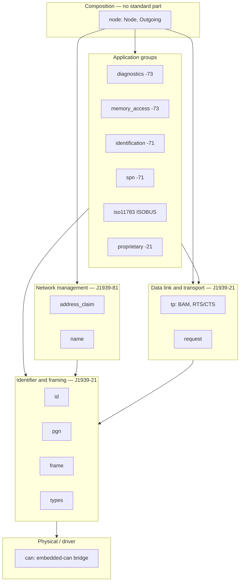
```mermaid
flowchart TB
    subgraph l5["Composition — no standard part"]
        n["node: Node, Outgoing"]
    end
    subgraph l4["Application groups"]
        d["diagnostics -73"]
        m["memory_access -73"]
        ident["identification -71"]
        s["spn -71"]
        iso["iso11783 ISOBUS"]
        p["proprietary -21"]
    end
    subgraph l3["Network management — J1939-81"]
        ac["address_claim"]
        nm["name"]
    end
    subgraph l2["Data link and transport — J1939-21"]
        tp["tp: BAM, RTS/CTS"]
        rq["request"]
    end
    subgraph l1["Identifier and framing — J1939-21"]
        id["id"]
        pg["pgn"]
        fr["frame"]
        ty["types"]
    end
    subgraph l0["Physical / driver"]
        cb["can: embedded-can bridge"]
    end

    n --> l4
    n --> l3
    n --> l2
    l4 --> l2
    l4 --> l1
    l3 --> l1
    l2 --> l1
    l1 --> l0
```

The arrows are the real dependency direction: nothing below reaches upward.
`tp` knows about `Pgn` and `Address` but not about `diagnostics`; `diagnostics`
produces a byte buffer and does not know whether it will travel in one frame or
255.

Two allocations deliberately overlap and the code says so:

- **ISO 11783 auxiliary valve measured position** occupies `0x00FF20..=0x00FF2F`,
  which sits *inside* the Proprietary B range `0x00FF00..=0x00FFFF`. Both
  `iso11783` and `proprietary` document this, and `ProprietaryB::from_pgn` will
  happily classify a valve position report as manufacturer-specific. On an
  ISOBUS network, check the ISO 11783 allocations first.
- **`identification` follows the standard where the C reference does not.**
  J1939-71 specifies asterisk-delimited fields, and that is what real diagnostic
  tools emit and expect. The Open-SAE-J1939 C reference stores these as
  fixed-width parallel arrays instead — a simplification local to that library,
  not the standard, so this module follows the specification. This is the one
  documented place the two disagree; elsewhere the C reference is used as a
  source of known-good bytes.

---

## 3. The 29-bit identifier and the PDU1/PDU2 split

This is the part of J1939 that most implementations get wrong, so both `id` and
`pgn` are built around enforcing it.

### The bit layout

```text
bit 28 .. 26   25    24    23 .......... 16   15 .......... 8   7 ......... 0
 Priority     EDP    DP    PDU Format (PF)    PDU Specific     Source Address
                           \______________ PGN ____________/
```

The PGN is itself 18 bits, assembled from four of those fields:

```text
PGN bit  17    16    15 .......... 8    7 ........... 0
        EDP    DP    PDU Format (PF)    PDU Specific (PS)
```

Concretely, for `Id::new(0x18FECA80)` — a DM1 broadcast from ECU `0x80`:

```text
0x18FECA80 = 0001 1000 1111 1110 1100 1010 1000 0000
              ^^^ priority 6      ^^^^^^^^^ PS = 0xCA
                 ^ EDP 0                    ^^^^^^^^ SA = 0x80
                  ^ DP 0
                   ^^^^^^^^ PF = 0xFE
             PGN = 0x00FECA  (PF 0xFE >= 0xF0, so PS is part of the PGN)
```

### The decision that changes everything

The PDU format byte alone decides what the *next* byte means.

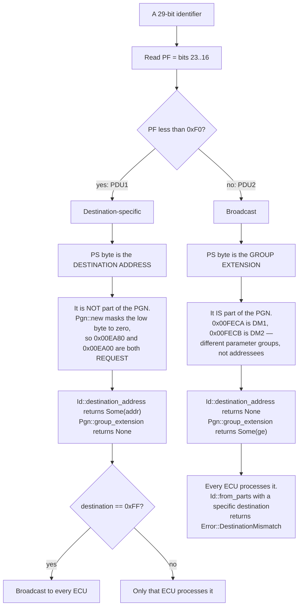
```mermaid
flowchart TD
    start["A 29-bit identifier"] --> pf["Read PF = bits 23..16"]
    pf --> q{"PF less than 0xF0?"}

    q -->|"yes: PDU1"| p1["Destination-specific"]
    q -->|"no: PDU2"| p2["Broadcast"]

    p1 --> p1a["PS byte is the DESTINATION ADDRESS"]
    p1a --> p1b["It is NOT part of the PGN.<br/>Pgn::new masks the low byte to zero,<br/>so 0x00EA80 and 0x00EA00 are both REQUEST"]
    p1b --> p1c["Id::destination_address returns Some(addr)<br/>Pgn::group_extension returns None"]
    p1c --> p1d{"destination == 0xFF?"}
    p1d -->|yes| p1e["Broadcast to every ECU"]
    p1d -->|no| p1f["Only that ECU processes it"]

    p2 --> p2a["PS byte is the GROUP EXTENSION"]
    p2a --> p2b["It IS part of the PGN.<br/>0x00FECA is DM1, 0x00FECB is DM2 —<br/>different parameter groups, not addressees"]
    p2b --> p2c["Id::destination_address returns None<br/>Pgn::group_extension returns Some(ge)"]
    p2c --> p2d["Every ECU processes it.<br/>Id::from_parts with a specific destination<br/>returns Error::DestinationMismatch"]
```

### How the types enforce it

The asymmetry is not left to the caller to remember. Three mechanisms carry it:

1. **`Pgn` is always normalised.** `Pgn::new` and `Pgn::new_masked` run
   `normalise`, which ANDs the value with `0x0003_FF00` when `PF < 0xF0` and
   leaves PDU2 values untouched. So `Pgn::new(0x00EA80) == pgn::REQUEST`, and
   `codec_sweep.rs` asserts across all 262,144 PGN values that a PDU1 PGN never
   keeps a low byte and a PDU2 PGN always round-trips exactly.

2. **Encoding refuses the impossible.** `Id::from_parts` returns
   `Error::DestinationMismatch` if a PDU2 PGN is given a non-global
   destination, rather than silently OR-ing the address into the group
   extension and corrupting the PGN. Because PDU1 PGNs are normalised, OR-ing
   the destination into the PDU-specific byte cannot disturb the PGN either.

3. **Decoding returns `Option`, not a byte.** `Id::destination_address` and
   `Pgn::group_extension` each return `None` for the format where the byte does
   not carry that meaning. `Id::pdu_specific` is available when you genuinely
   want the raw byte whatever it means.

The consequence for the receive path is `Id::is_addressed_to`, which is the
filter every J1939 ECU applies:

```rust
match self.destination_address() {
    Some(destination) => destination.is_broadcast() || destination.as_u8() == address.as_u8(),
    None => true,   // PDU2: everybody's business
}
```

One consequence surfaces in `Outgoing::new` and is worth stating plainly: a PDU2
parameter group **cannot** be addressed to one ECU in a single frame, but
**can** be sent to one ECU over the transport protocol — because TP.CM and
TP.DT are themselves PDU1 groups, and the transported PGN travels in their
payload rather than in the identifier.

---

## 4. Receive data flow

A frame arrives, and one of four things happens to it: it is filtered out,
absorbed by address claiming, absorbed by reassembly, or delivered.

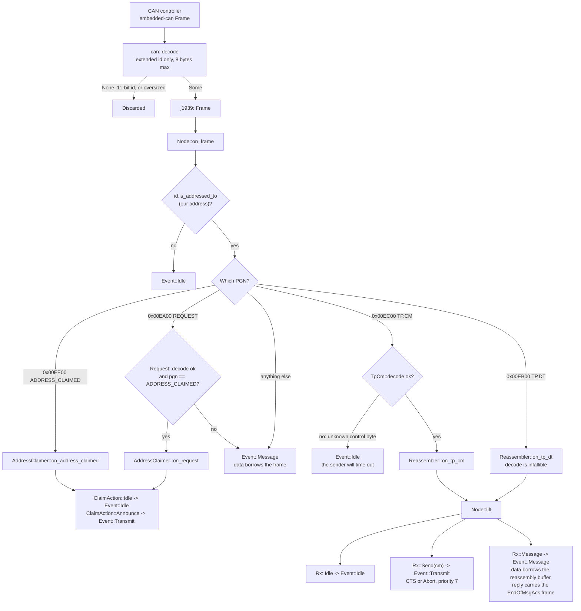
```mermaid
flowchart TD
    wire["CAN controller<br/>embedded-can Frame"] --> dec["can::decode<br/>extended id only, 8 bytes max"]
    dec -->|"None: 11-bit id, or oversized"| drop1["Discarded"]
    dec -->|"Some"| f["j1939::Frame"]
    f --> onframe["Node::on_frame"]

    onframe --> filt{"id.is_addressed_to<br/>(our address)?"}
    filt -->|no| idle1["Event::Idle"]
    filt -->|yes| grp{"Which PGN?"}

    grp -->|"0x00EE00 ADDRESS_CLAIMED"| ac["AddressClaimer::on_address_claimed"]
    ac --> act["ClaimAction::Idle -> Event::Idle<br/>ClaimAction::Announce -> Event::Transmit"]

    grp -->|"0x00EA00 REQUEST"| req{"Request::decode ok<br/>and pgn == ADDRESS_CLAIMED?"}
    req -->|yes| onreq["AddressClaimer::on_request"]
    onreq --> act
    req -->|no| deliver

    grp -->|"0x00EC00 TP.CM"| cm{"TpCm::decode ok?"}
    cm -->|"no: unknown control byte"| idle2["Event::Idle<br/>the sender will time out"]
    cm -->|yes| rxcm["Reassembler::on_tp_cm"]

    grp -->|"0x00EB00 TP.DT"| rxdt["Reassembler::on_tp_dt<br/>decode is infallible"]

    grp -->|"anything else"| deliver["Event::Message<br/>data borrows the frame"]

    rxcm --> lift["Node::lift"]
    rxdt --> lift
    lift --> l1["Rx::Idle -> Event::Idle"]
    lift --> l2["Rx::Send(cm) -> Event::Transmit<br/>CTS or Abort, priority 7"]
    lift --> l3["Rx::Message -> Event::Message<br/>data borrows the reassembly buffer,<br/>reply carries the EndOfMsgAck frame"]
```

Ordering matters and is fixed in the source: the destination filter runs first,
then address-claim traffic, then requests, then TP.CM, then TP.DT, then
everything else falls through to `Event::Message`. A `Request` for a PGN other
than `ADDRESS_CLAIMED` deliberately falls through to the application — the node
answers only for its own NAME, and what to do about a request for DM1 is a
decision the application has to make.

A complete multi-packet receive, end to end:

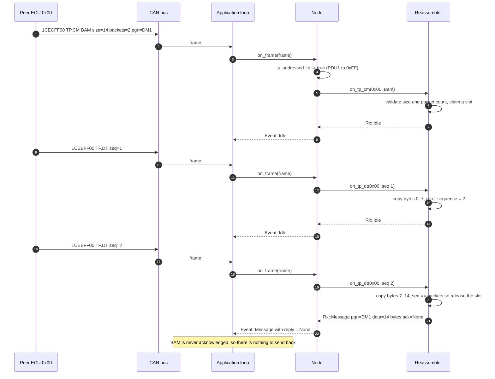
```mermaid
sequenceDiagram
    autonumber
    participant Peer as Peer ECU 0x00
    participant Bus as CAN bus
    participant App as Application loop
    participant N as Node
    participant R as Reassembler

    Peer->>Bus: 1CECFF00 TP.CM BAM size=14 packets=2 pgn=DM1
    Bus->>App: frame
    App->>N: on_frame(frame)
    N->>N: is_addressed_to -> true (PDU1 to 0xFF)
    N->>R: on_tp_cm(0x00, Bam)
    R->>R: validate size and packet count, claim a slot
    R-->>N: Rx::Idle
    N-->>App: Event::Idle

    Peer->>Bus: 1CEBFF00 TP.DT seq=1
    Bus->>App: frame
    App->>N: on_frame(frame)
    N->>R: on_tp_dt(0x00, seq 1)
    R->>R: copy bytes 0..7, next_sequence = 2
    R-->>N: Rx::Idle
    N-->>App: Event::Idle

    Peer->>Bus: 1CEBFF00 TP.DT seq=2
    Bus->>App: frame
    App->>N: on_frame(frame)
    N->>R: on_tp_dt(0x00, seq 2)
    R->>R: copy bytes 7..14, seq == packets so release the slot
    R-->>N: Rx::Message pgn=DM1 data=14 bytes ack=None
    N-->>App: Event::Message with reply = None
    Note over App: BAM is never acknowledged, so there is nothing to send back
```

**Zero-copy, twice.** `Node::on_frame` is
`fn on_frame<'a>(&'a mut self, frame: &'a Frame) -> Event<'a>`. For a
single-frame message the returned `data` borrows the frame; for a reassembled
one it borrows the node's own buffer. Nothing is copied on the receive path in
the core at all. The cost is that the event must be handled before the next
frame is fed in — which the borrow checker enforces, so it cannot be got wrong
silently. `Ecu` is where a copy finally happens: `bus::Message` owns a `Vec<u8>`,
because a host caller wants to keep the payload past the next `poll`.

---

## 5. Transmit data flow

`Outgoing` exists because sending a J1939 message is not one decision but
three: does it fit in a frame, is it addressed or broadcast, and if it is
neither short nor broadcast, who drives the handshake?

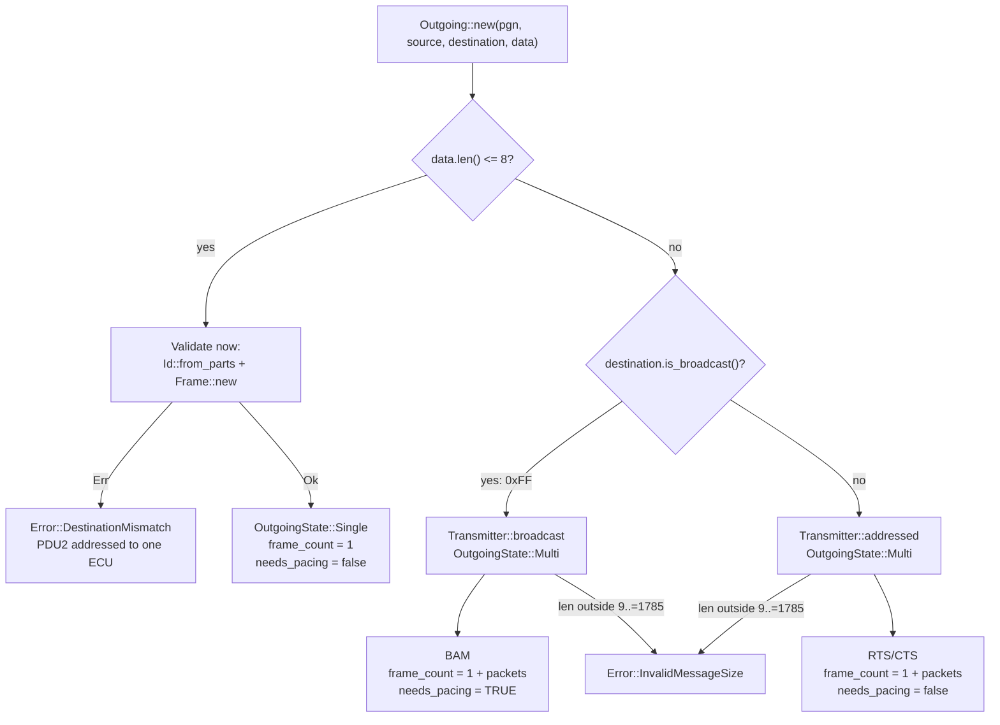
```mermaid
flowchart TD
    new["Outgoing::new(pgn, source, destination, data)"] --> len{"data.len() <= 8?"}

    len -->|yes| single["Validate now:<br/>Id::from_parts + Frame::new"]
    single -->|"Err"| e1["Error::DestinationMismatch<br/>PDU2 addressed to one ECU"]
    single -->|"Ok"| singleok["OutgoingState::Single<br/>frame_count = 1<br/>needs_pacing = false"]

    len -->|no| bcast{"destination.is_broadcast()?"}

    bcast -->|"yes: 0xFF"| bam["Transmitter::broadcast<br/>OutgoingState::Multi"]
    bam --> bamok["BAM<br/>frame_count = 1 + packets<br/>needs_pacing = TRUE"]

    bcast -->|no| rts["Transmitter::addressed<br/>OutgoingState::Multi"]
    rts --> rtsok["RTS/CTS<br/>frame_count = 1 + packets<br/>needs_pacing = false"]

    bam -->|"len outside 9..=1785"| e2["Error::InvalidMessageSize"]
    rts -->|"len outside 9..=1785"| e2
```

Once constructed, the caller pulls frames:

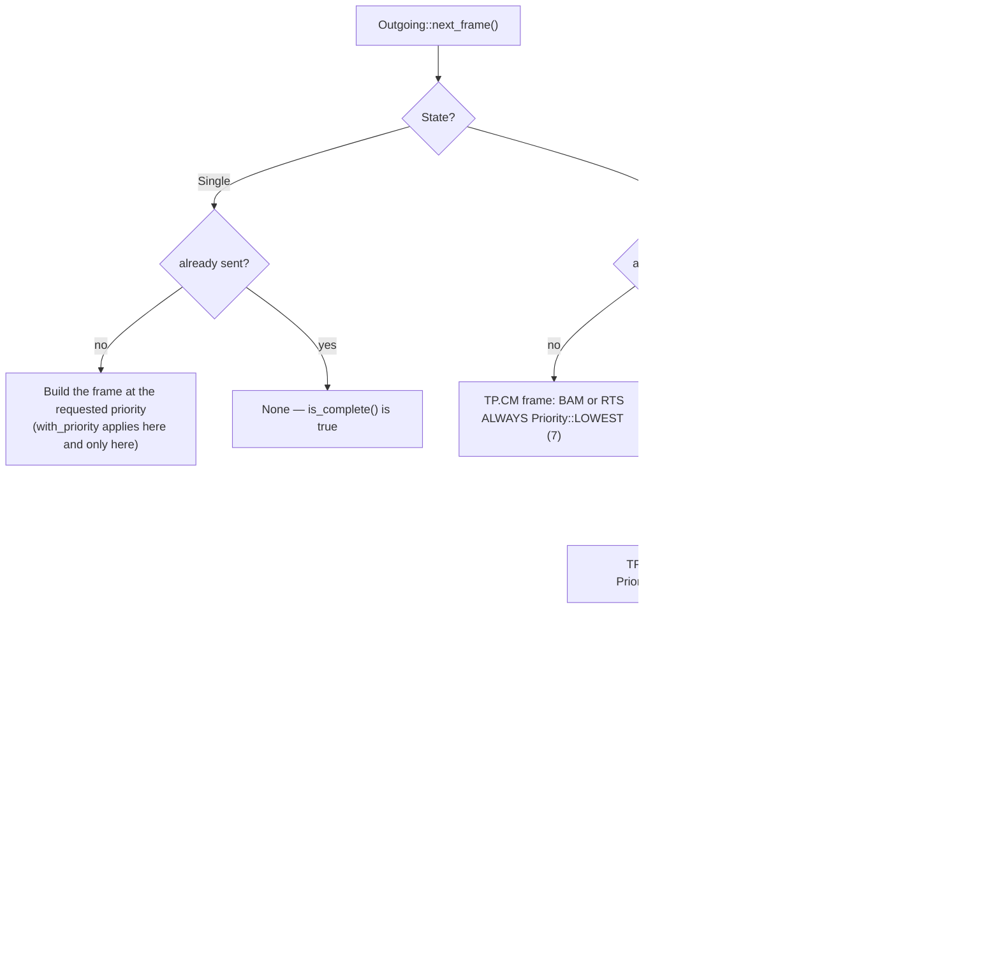
```mermaid
flowchart TD
    nf["Outgoing::next_frame()"] --> st{"State?"}
    st -->|Single| s1{"already sent?"}
    s1 -->|no| s2["Build the frame at the requested priority<br/>(with_priority applies here and only here)"]
    s1 -->|yes| none1["None — is_complete() is true"]

    st -->|Multi| m1{"announced?"}
    m1 -->|no| m2["TP.CM frame: BAM or RTS<br/>ALWAYS Priority::LOWEST (7)"]
    m1 -->|yes| m3["Transmitter::next_packet()"]
    m3 -->|Some| m4["TP.DT frame, Priority::LOWEST"]
    m3 -->|None| none2["None — either finished,<br/>or the CTS window is exhausted.<br/>Check is_complete() to tell them apart"]

    m4 --> pace{"needs_pacing()?"}
    pace -->|"yes: BAM"| wait["Caller waits 50-200 ms<br/>Ecu uses BAM_PACKET_INTERVAL = 50 ms"]
    pace -->|"no: RTS/CTS"| flow["Caller feeds peer replies to on_frame()"]
```

Three details that are easy to get wrong and are therefore fixed in the code:

- **Transport-protocol frames ignore `with_priority`.** J1939-21 fixes TP
  traffic at priority 7 so that bulk transfers yield to control traffic. Both
  `tp_id` in `node.rs` and `tp_cm_frame` hard-code `Priority::LOWEST`, and a
  unit test asserts that a `with_priority(Priority::HIGHEST)` message still goes
  out at 7 once it becomes a BAM.
- **`next_frame()` returning `None` is ambiguous on purpose**, and
  `is_complete()` disambiguates. A BAM is complete the moment the last packet is
  produced; an RTS/CTS transfer is complete only when the `EndOfMsgAck` arrives.
- **`Outgoing` borrows the payload** (`&'a [u8]`) rather than copying it, so a
  1785-byte message costs no extra RAM on an MCU.

`Outgoing::on_frame` filters replies to the ones that could belong to this
transfer: PGN must be `TP_CM` **and** the source must be this message's
destination. A `Cts` from an unrelated ECU returns `Progress::Idle` and does
not open the window — there is a test for exactly that.

On the host, `Ecu` wraps this loop. `Ecu::broadcast` sleeps
`BAM_PACKET_INTERVAL` (50 ms) between data packets but sends the announcement
immediately. `Ecu::send_to` blocks, reading frames and feeding them to
`Outgoing::on_frame`, with a `HANDSHAKE_TIMEOUT` of 1250 ms that is reset on
every granted window; ordinary traffic arriving mid-handshake is dispatched
normally and queued for the next `poll` rather than dropped.

---

## 6. Transport protocol sequences

A CAN frame carries eight bytes. Anything larger — a DM1 with two or more
trouble codes, an ECU identification string, a commanded address — is split
across numbered TP.DT frames bracketed by TP.CM frames. The protocol carries
9 to 1785 bytes: 255 packets of seven.

| Control byte | Message | Direction |
|---|---|---|
| `0x10` | RTS — Request To Send | sender → receiver |
| `0x11` | CTS — Clear To Send | receiver → sender |
| `0x13` | EndOfMsgAck | receiver → sender |
| `0x20` | BAM — Broadcast Announce | sender → everyone |
| `0xFF` | Abort | either |

### BAM: broadcast, unacknowledged, paced

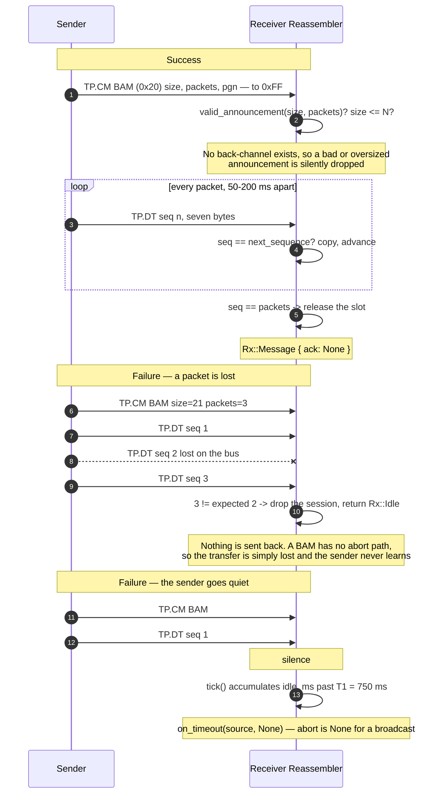
```mermaid
sequenceDiagram
    autonumber
    participant S as Sender
    participant R as Receiver Reassembler

    Note over S,R: Success
    S->>R: TP.CM BAM (0x20) size, packets, pgn — to 0xFF
    R->>R: valid_announcement(size, packets)? size <= N?
    Note over R: No back-channel exists, so a bad or oversized<br/>announcement is silently dropped
    loop every packet, 50-200 ms apart
        S->>R: TP.DT seq n, seven bytes
        R->>R: seq == next_sequence? copy, advance
    end
    R->>R: seq == packets -> release the slot
    Note over R: Rx::Message { ack: None }

    Note over S,R: Failure — a packet is lost
    S->>R: TP.CM BAM size=21 packets=3
    S->>R: TP.DT seq 1
    S--xR: TP.DT seq 2 lost on the bus
    S->>R: TP.DT seq 3
    R->>R: 3 != expected 2 -> drop the session, return Rx::Idle
    Note over R: Nothing is sent back. A BAM has no abort path,<br/>so the transfer is simply lost and the sender never learns

    Note over S,R: Failure — the sender goes quiet
    S->>R: TP.CM BAM
    S->>R: TP.DT seq 1
    Note over R: silence
    R->>R: tick() accumulates idle_ms past T1 = 750 ms
    Note over R: on_timeout(source, None) — abort is None for a broadcast
```

Pacing is the caller's job because the state machine owns no clock. `Transmitter`
documents the requirement, `Outgoing::needs_pacing()` reports it, and
`Ecu::broadcast` is where an actual `thread::sleep` finally appears.

### RTS/CTS: addressed, windowed, acknowledged

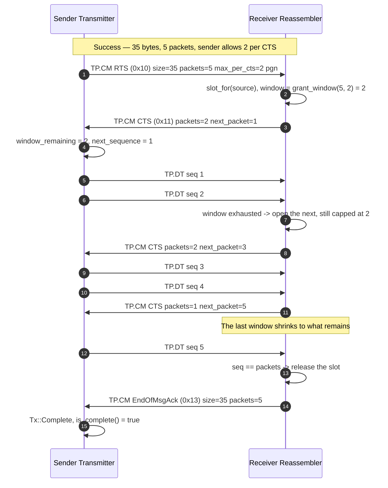
```mermaid
sequenceDiagram
    autonumber
    participant S as Sender Transmitter
    participant R as Receiver Reassembler

    Note over S,R: Success — 35 bytes, 5 packets, sender allows 2 per CTS
    S->>R: TP.CM RTS (0x10) size=35 packets=5 max_per_cts=2 pgn
    R->>R: slot_for(source), window = grant_window(5, 2) = 2
    R->>S: TP.CM CTS (0x11) packets=2 next_packet=1
    S->>S: window_remaining = 2, next_sequence = 1
    S->>R: TP.DT seq 1
    S->>R: TP.DT seq 2
    R->>R: window exhausted -> open the next, still capped at 2
    R->>S: TP.CM CTS packets=2 next_packet=3
    S->>R: TP.DT seq 3
    S->>R: TP.DT seq 4
    R->>S: TP.CM CTS packets=1 next_packet=5
    Note over R: The last window shrinks to what remains
    S->>R: TP.DT seq 5
    R->>R: seq == packets -> release the slot
    R->>S: TP.CM EndOfMsgAck (0x13) size=35 packets=5
    S->>S: Tx::Complete, is_complete() = true
```

The per-CTS limit is carried on the `Session` for the life of the transfer, not
just applied to the first window — a sender that says "two at a time" because it
is reading slowly from flash must be obeyed every time, and there is a test
named for exactly that.

Every abort path:

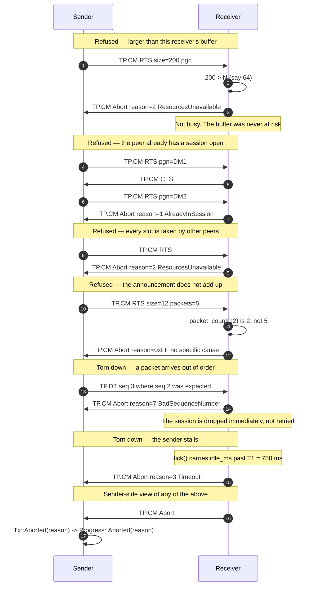
```mermaid
sequenceDiagram
    autonumber
    participant S as Sender
    participant R as Receiver

    Note over S,R: Refused — larger than this receiver's buffer
    S->>R: TP.CM RTS size=200 pgn
    R->>R: 200 > N (say 64)
    R->>S: TP.CM Abort reason=2 ResourcesUnavailable
    Note over R: Not busy. The buffer was never at risk

    Note over S,R: Refused — the peer already has a session open
    S->>R: TP.CM RTS pgn=DM1
    R->>S: TP.CM CTS
    S->>R: TP.CM RTS pgn=DM2
    R->>S: TP.CM Abort reason=1 AlreadyInSession

    Note over S,R: Refused — every slot is taken by other peers
    S->>R: TP.CM RTS
    R->>S: TP.CM Abort reason=2 ResourcesUnavailable

    Note over S,R: Refused — the announcement does not add up
    S->>R: TP.CM RTS size=12 packets=5
    R->>R: packet_count(12) is 2, not 5
    R->>S: TP.CM Abort reason=0xFF no specific cause

    Note over S,R: Torn down — a packet arrives out of order
    S->>R: TP.DT seq 3 where seq 2 was expected
    R->>S: TP.CM Abort reason=7 BadSequenceNumber
    Note over R: The session is dropped immediately, not retried

    Note over S,R: Torn down — the sender stalls
    Note over R: tick() carries idle_ms past T1 = 750 ms
    R->>S: TP.CM Abort reason=3 Timeout

    Note over S,R: Sender-side view of any of the above
    R->>S: TP.CM Abort
    S->>S: Tx::Aborted(reason) -> Progress::Aborted(reason)
```

Note the asymmetry between the two flavours throughout: identical failures
produce an abort under RTS/CTS and silence under BAM, because a broadcast has no
back-channel to complain on. `Rx::Message` carries `ack: Option<TpCm>` for the
same reason — `Some(EndOfMsgAck)` for RTS/CTS, `None` for BAM.

The four J1939-21 timers are exported as `T1_TIMEOUT_MS` (750),
`T2_TIMEOUT_MS` (1250), `T3_TIMEOUT_MS` (1250) and `T4_TIMEOUT_MS` (1050).
Only **T1** is enforced by the state machines, in `Reassembler::tick`; the other
three are constants for callers to build their own timing on. `Ecu`'s
`HANDSHAKE_TIMEOUT` of 1250 ms is the sender-side T3 equivalent, implemented in
the host crate rather than in `Transmitter`.

---

## 7. Address claiming state machine

J1939 addresses are not configured, they are claimed. An ECU broadcasts Address
Claimed (`0x00EE00`) carrying its 64-bit NAME with its desired address as the
frame's source address. If two ECUs want the same address, the one with the
numerically **lower** NAME keeps it.

`Name` is compared as a plain `u64` — `wins_arbitration_against` is literally
`self.0 < other.0` — and the nine fields are ordered so the most significant
dominate:

| Bits | Width | Field |
|---|---|---|
| 63 | 1 | Arbitrary Address Capable |
| 62..60 | 3 | Industry Group |
| 59..56 | 4 | Vehicle System Instance |
| 55..49 | 7 | Vehicle System |
| 48 | 1 | Reserved |
| 47..40 | 8 | Function |
| 39..35 | 5 | Function Instance |
| 34..32 | 3 | ECU Instance |
| 31..21 | 11 | Manufacturer Code |
| 20..0 | 21 | Identity Number |

Two consequences fall straight out of that layout. The identity number sits in
the least significant bits, so two otherwise identical ECUs from one
manufacturer are still separated by serial number and arbitration always
terminates. And arbitrary-address-capable sets the *top* bit, so such an ECU
always loses to one that is not — which is precisely what makes it the party
that moves. The NAME goes on the wire little-endian.

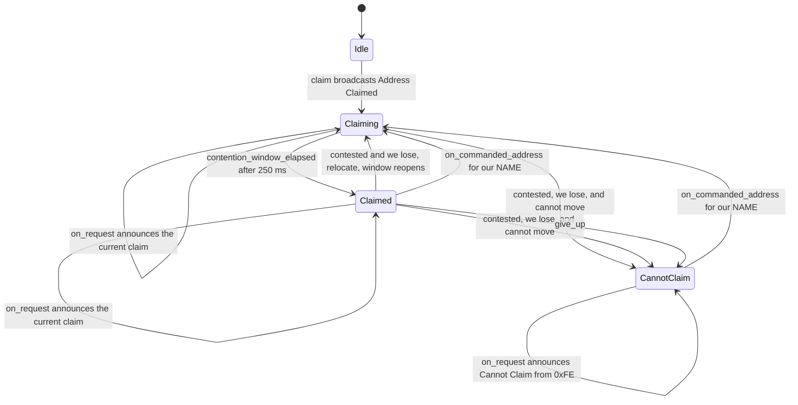
```mermaid
stateDiagram-v2
    [*] --> Idle

    Idle --> Claiming: claim broadcasts Address Claimed

    Claiming --> Claimed: contention_window_elapsed after 250 ms
    Claiming --> Claiming: contested and we win, re-announce
    Claiming --> Claiming: contested and we lose, relocate and re-announce
    Claiming --> CannotClaim: contested, we lose, and cannot move

    Claimed --> Claimed: contested and we win, re-announce to defend
    Claimed --> Claiming: contested and we lose, relocate, window reopens
    Claimed --> CannotClaim: contested, we lose, and cannot move
    Claimed --> Claiming: on_commanded_address for our NAME
    Claimed --> CannotClaim: give_up

    CannotClaim --> Claiming: on_commanded_address for our NAME

    Claiming --> Claiming: on_request announces the current claim
    Claimed --> Claimed: on_request announces the current claim
    CannotClaim --> CannotClaim: on_request announces Cannot Claim from 0xFE
```

"Contested" above means `on_address_claimed` reporting another ECU claiming the
address this one holds or is claiming. Relocation is available only to an
arbitrary-address-capable NAME with a free address left in `128..=247`.

Reading the code branch by branch, `on_address_claimed(source, name)` does:

1. **`name == self.name`** — our own claim echoed back by the bus. `Idle`.
2. Record `source` in the seen-address bitmap if it is a specific address
   (`0..=0xFD`). This costs 32 bytes and is what lets relocation pick a free
   address rather than guess.
3. **`source != self.address`, or we are already `CannotClaim`** — not our
   fight. `Idle`.
4. **We win** (`self.name.wins_arbitration_against(name)`) — re-announce the
   same claim. `ClaimAction::Announce`. Note the state is *not* changed: a
   `Claimed` ECU defending stays `Claimed`.
5. **We lose and are arbitrary-address-capable** — `next_free_address()` scans
   `DYNAMIC_ADDRESS_START..=DYNAMIC_ADDRESS_END` (128..=247) for the lowest
   address not in the seen bitmap and not our current one. Take it, go back to
   `Claiming`, announce.
6. **We lose and cannot move, or the whole dynamic range is occupied** —
   `give_up()`: state becomes `CannotClaim`, `self.address` becomes
   `Address::NULL` (`0xFE`), and the announcement is the Cannot Claim Address
   message. It is the same PGN sent from `0xFE`; an ECU that stops using an
   address must say so.

`give_up` returns a `Claim` rather than a `ClaimAction` because there is always
something to broadcast — a variant that could never be `Idle` would be a lie in
the type.

### The 250 ms window

`AddressClaimer` owns no timer. The window is counted by whoever owns a clock:

- **`Node`** holds `claim_elapsed_ms` and `ADDRESS_CLAIM_WINDOW_MS = 250`.
  `Node::tick` accumulates elapsed milliseconds while the state is `Claiming`
  and calls `contention_window_elapsed()` once the total reaches 250. Crucially,
  `Node::act_on_claim` resets `claim_elapsed_ms` to zero whenever an announcement
  is produced while still `Claiming` — a fresh claim reopens the window.
- **`Ecu::claim_address`** blocks on real time. It sends the initial claim, then
  loops until either `has_address()` or `CannotClaim`, capped by
  `CLAIM_TIMEOUT = 3 s`. The three-second cap rather than 250 ms is deliberate
  and there is a regression test for it: relocating opens a *fresh* window, so
  waiting one window from the first claim would report a still-settling ECU as
  failed. Traffic arriving during the window is queued for `poll`, not dropped —
  also a regression test, since other ECUs are under no obligation to stay quiet.

### Transmit interlock

J1939-81 forbids transmitting from an address you have not claimed.
`Ecu::check_may_transmit` enforces this: `request`, `broadcast` and `send_to`
all return `io::ErrorKind::NotConnected` before an address is held, with a
message that distinguishes "no address claimed yet" from "lost arbitration and
must stay off the bus". The core's `Node` and `Outgoing` do not enforce it —
they will build whatever frame you ask for.

---

## 8. Reassembler session model

```rust
pub struct Reassembler<const N: usize, const SESSIONS: usize = 1> {
    slots: [Slot<N>; SESSIONS],
}

struct Slot<const N: usize> {
    buffer: [u8; N],
    session: Option<Session>,
}
```

Sessions are **keyed by peer source address**, held in a fixed array, and found
by linear scan (`slot_of` matches on `session.source`). There is no map and no
hashing: `SESSIONS` is small by construction, and a scan of eight elements is
cheaper than anything with a hasher on a Cortex-M.

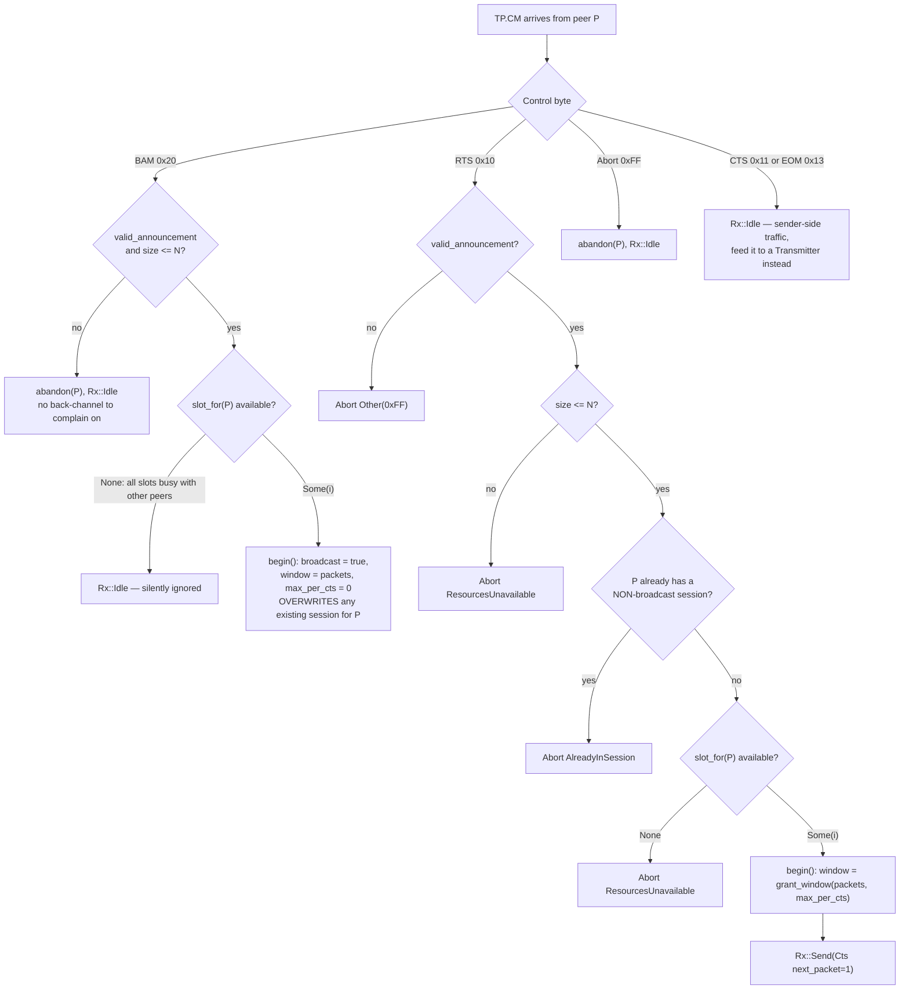
```mermaid
flowchart TD
    cm["TP.CM arrives from peer P"] --> kind{"Control byte"}

    kind -->|"BAM 0x20"| b1{"valid_announcement<br/>and size <= N?"}
    b1 -->|no| b2["abandon(P), Rx::Idle<br/>no back-channel to complain on"]
    b1 -->|yes| b3{"slot_for(P) available?"}
    b3 -->|"None: all slots busy with other peers"| b4["Rx::Idle — silently ignored"]
    b3 -->|"Some(i)"| b5["begin(): broadcast = true,<br/>window = packets, max_per_cts = 0<br/>OVERWRITES any existing session for P"]

    kind -->|"RTS 0x10"| r1{"valid_announcement?"}
    r1 -->|no| r2["Abort Other(0xFF)"]
    r1 -->|yes| r3{"size <= N?"}
    r3 -->|no| r4["Abort ResourcesUnavailable"]
    r3 -->|yes| r5{"P already has a<br/>NON-broadcast session?"}
    r5 -->|yes| r6["Abort AlreadyInSession"]
    r5 -->|no| r7{"slot_for(P) available?"}
    r7 -->|None| r8["Abort ResourcesUnavailable"]
    r7 -->|"Some(i)"| r9["begin(): window = grant_window(packets, max_per_cts)"]
    r9 --> r10["Rx::Send(Cts next_packet=1)"]

    kind -->|"Abort 0xFF"| a1["abandon(P), Rx::Idle"]
    kind -->|"CTS 0x11 or EOM 0x13"| s1["Rx::Idle — sender-side traffic,<br/>feed it to a Transmitter instead"]
```

`slot_for(source)` returns the peer's existing slot if it has one, otherwise the
first slot with no session. That single rule produces the whole allocation
policy: one session per peer, first-come-first-served across peers, and no
starvation of an in-progress transfer by a new one.

Data packets:

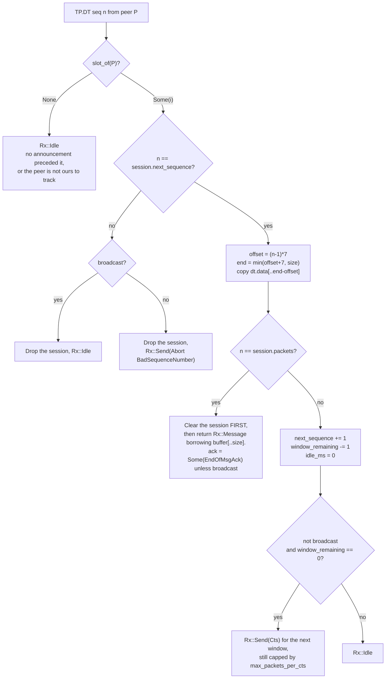
```mermaid
flowchart TD
    dt["TP.DT seq n from peer P"] --> f1{"slot_of(P)?"}
    f1 -->|None| i1["Rx::Idle<br/>no announcement preceded it,<br/>or the peer is not ours to track"]
    f1 -->|"Some(i)"| f2{"n == session.next_sequence?"}

    f2 -->|no| bq{"broadcast?"}
    bq -->|yes| bq1["Drop the session, Rx::Idle"]
    bq -->|no| bq2["Drop the session,<br/>Rx::Send(Abort BadSequenceNumber)"]

    f2 -->|yes| c1["offset = (n-1)*7<br/>end = min(offset+7, size)<br/>copy dt.data[..end-offset]"]
    c1 --> c2{"n == session.packets?"}
    c2 -->|yes| done["Clear the session FIRST,<br/>then return Rx::Message borrowing buffer[..size].<br/>ack = Some(EndOfMsgAck) unless broadcast"]
    c2 -->|no| adv["next_sequence += 1<br/>window_remaining -= 1<br/>idle_ms = 0"]
    adv --> w{"not broadcast<br/>and window_remaining == 0?"}
    w -->|yes| cts["Rx::Send(Cts) for the next window,<br/>still capped by max_packets_per_cts"]
    w -->|no| i2["Rx::Idle"]
```

Behaviours worth stating explicitly, all verified against the source or its
tests:

- **Overflow is refused, never truncated.** A transfer announcing more than `N`
  bytes is aborted (`ResourcesUnavailable`) for RTS/CTS and dropped for BAM.
  The buffer write itself is bounded twice over: `end` is clamped to
  `session.size`, and `size <= N` was checked at announcement time.
- **Completion is checked before advancing.** `next_sequence` is a `u8`; a
  255-packet transfer is the protocol maximum, so incrementing past the last
  packet would wrap. The order of those two lines is load-bearing and the
  comment says so.
- **The slot is released before the payload is handed out**, so it is
  immediately available for the next transfer while the caller still holds a
  borrow of the bytes.
- **Out of order is fatal, not recoverable.** There is no retransmit request.
  J1939-21 defines one, and this implementation does not use it: the session is
  torn down and the sender must start again.
- **A second BAM from the same peer replaces the first.** The
  `AlreadyInSession` check only fires for a non-broadcast session, and BAM's
  `slot_for` returns the peer's existing slot — so a sender that abandons a
  broadcast mid-flight and starts a new one simply takes over the slot. Verified
  by driving it: the second BAM completes and delivers, the first is lost.
- **Timeouts are per session, not global.** `tick` walks every slot,
  accumulating `idle_ms` with `saturating_add` and expiring only those past the
  threshold. A stalled peer does not disturb an active one. `reset()` drops
  everything; `abandon(peer)` drops one.
- **Stray packets are ignored.** A TP.DT from an ECU with no session returns
  `Rx::Idle` without touching anyone else's slot.

One interaction between layers is worth knowing about, because it is not
obvious from either module alone: if a `Node` **relocates** to a new address
while a peer has a transfer in flight, the reassembler session survives the move
(it is keyed by the *peer's* address, not ours), but the peer is still sending
to the old destination — so `Node::on_frame`'s destination filter discards those
packets before the reassembler ever sees them, and the session lingers until T1
expires. The outcome is correct; it just takes 750 ms to get there.

---

## 9. Diagnostic fault lifecycle

Diagnostics has two sides, and they need different things from the crate.

A **tool** reading someone else's faults needs only a codec: bytes in, trouble
codes out. That is `diagnostics::Message`, and it is stateless.

An **ECU** reporting its own needs memory. Which faults are active, which have
been active, how many times each has occurred, which lamps they light, and when
the next DM1 is due — none of that is derivable from a single message. That is
`fault_log::FaultLog<N>`, and it is the only stateful piece in the diagnostic
layer.

### The state a fault moves through

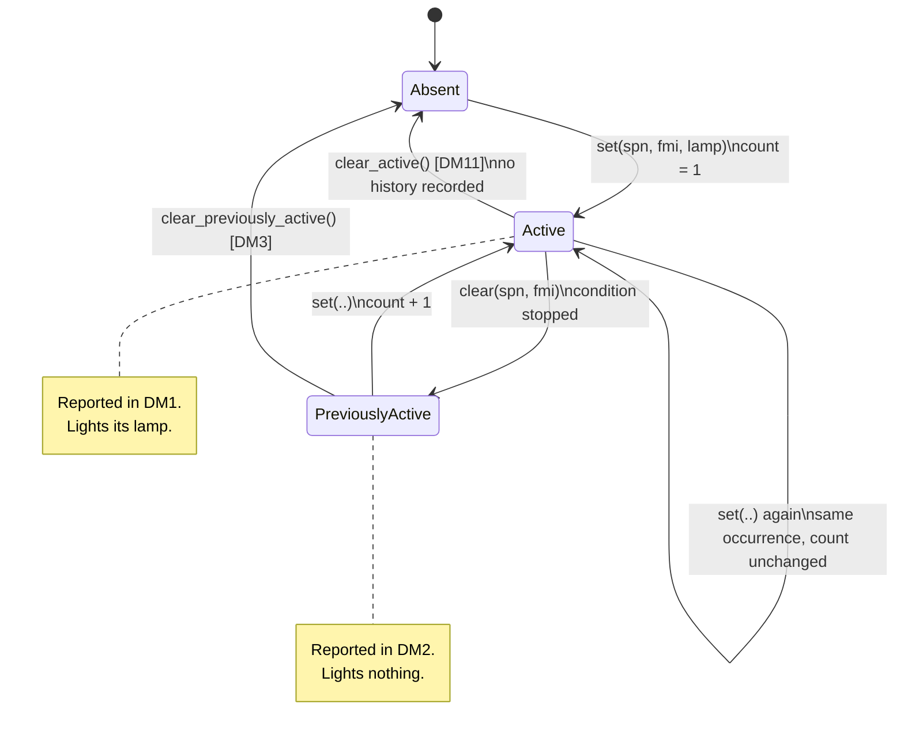
```mermaid
stateDiagram-v2
    [*] --> Absent
    Absent --> Active: set(spn, fmi, lamp)\ncount = 1
    Active --> Active: set(..) again\nsame occurrence, count unchanged
    Active --> PreviouslyActive: clear(spn, fmi)\ncondition stopped
    PreviouslyActive --> Active: set(..)\ncount + 1
    Active --> Absent: clear_active() [DM11]\nno history recorded
    PreviouslyActive --> Absent: clear_previously_active() [DM3]

    note right of Active
        Reported in DM1.
        Lights its lamp.
    end note
    note right of PreviouslyActive
        Reported in DM2.
        Lights nothing.
    end note
```

Three transitions carry a decision worth stating:

- **`Active --> Active` does not touch the occurrence count.** J1939-73 counts
  inactive-to-active transitions, not assertions. Firmware that re-checks a
  condition every control cycle would otherwise report a count of several
  thousand within a minute.
- **`Active --> Absent` on DM11 records no history.** A reset command is not
  evidence that the condition stopped. If it persists, the ECU raises the fault
  again from a fresh count; writing it into the previously-active list would
  claim something happened that did not.
- **`PreviouslyActive --> Active` resumes the count.** A fault that comes back is
  the same fault, and the count is why anyone cares.

### Capacity, and which end to lose from

Both lists are bounded by `N`, and they overflow in opposite directions on
purpose:

| List | When full | Why |
|------|-----------|-----|
| Active | Refuse the newest | In a cascade the first fault is usually the cause and the rest are consequences |
| Previously active | Drop the oldest | It is a history, and a technician is diagnosing the recent past |

### Who transmits

`FaultLog` owns no bus and no clock, so it cannot transmit — it only says *when*
a DM1 is due. J1939-73 asks for one per second while any fault is active, one
more when the last clears, then silence; both rules collapse into a single timer
because the standard's "report on change" is capped at once per second anyway.

That final all-clear is not decoration. The periodic DM1 stops when the fault
list empties, so without an explicit "nothing is wrong any more" a tool cannot
tell a repaired ECU from one that fell off the bus.

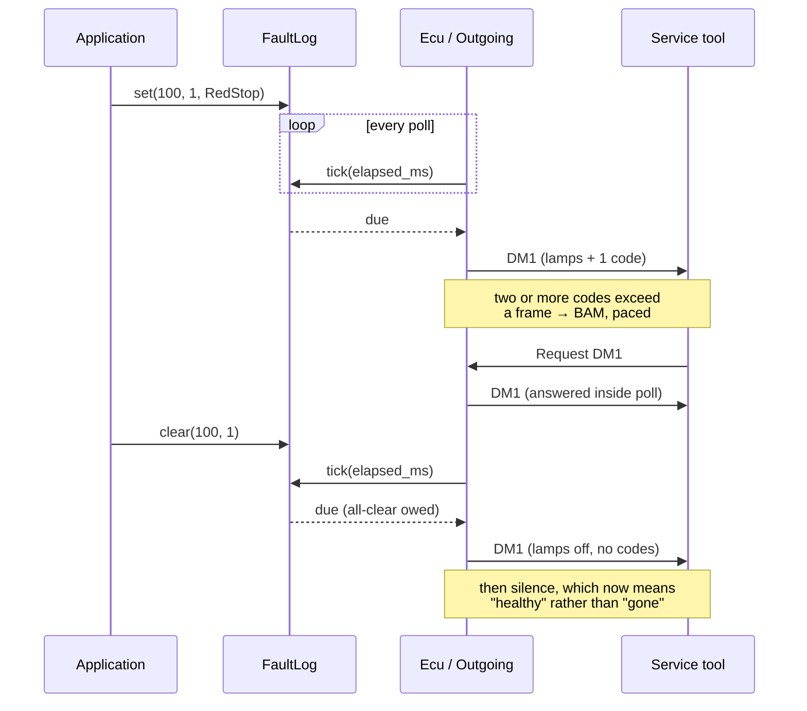
```mermaid
sequenceDiagram
    participant App as Application
    participant Log as FaultLog
    participant Ecu as Ecu / Outgoing
    participant Tool as Service tool

    App->>Log: set(100, 1, RedStop)
    loop every poll
        Ecu->>Log: tick(elapsed_ms)
    end
    Log-->>Ecu: due
    Ecu->>Tool: DM1 (lamps + 1 code)
    Note over Ecu,Tool: two or more codes exceed<br/>a frame → BAM, paced

    Tool->>Ecu: Request DM1
    Ecu->>Tool: DM1 (answered inside poll)

    App->>Log: clear(100, 1)
    Ecu->>Log: tick(elapsed_ms)
    Log-->>Ecu: due (all-clear owed)
    Ecu->>Tool: DM1 (lamps off, no codes)
    Note over Ecu,Tool: then silence, which now means<br/>"healthy" rather than "gone"
```

On a host, `Ecu` closes this loop: it owns a `FaultLog`, ticks it from `poll`,
and answers requests for DM1, DM2 and DM5 plus DM3 and DM11 clears. On a
microcontroller the application does the same three lines itself — see
`core/examples/mcu_node.rs` — because putting a transmit path inside `Node`
would give it a clock, which is the one thing the sans-I/O design is protecting.

### Where the tool side lives

Symmetrically, `Ecu` is also the tool: `request_wait` sends a request and blocks
for the answer, and `read_active_faults`, `read_readiness` and the rest are thin
layers over it. The distinction the API preserves is between **no answer** and
**refused** — J1939 has no obligatory "unsupported" reply, so silence is the
normal way of declining, while an explicit negative acknowledgement means the
ECU heard and said no. Collapsing those two into one result would lose the only
signal that tells you whether the ECU is even there.

---

## 10. Memory model

Nothing in the core allocates. Every encoder writes into a fixed array
(`[u8; 3]`, `[u8; 8]`) or a caller-supplied `&mut [u8]`; every parser borrows
(`diagnostics::Message<'a>`, `Dm16<'a>`, `identification::Fields<'a>`,
`Transmitter<'a>`, `Outgoing<'a>`). The only sizeable buffers in the crate are
the reassembly slots, and they are const-generic so their size is a number you
choose at compile time rather than a surprise at runtime.

There are exactly two parameters, and they thread through unchanged:

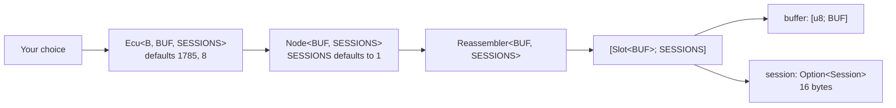
```mermaid
flowchart LR
    app["Your choice"] --> ecu["Ecu&lt;B, BUF, SESSIONS&gt;<br/>defaults 1785, 8"]
    ecu --> node["Node&lt;BUF, SESSIONS&gt;<br/>SESSIONS defaults to 1"]
    node --> re["Reassembler&lt;BUF, SESSIONS&gt;"]
    re --> slots["[Slot&lt;BUF&gt;; SESSIONS]"]
    slots --> buf["buffer: [u8; BUF]"]
    slots --> sess["session: Option&lt;Session&gt;<br/>16 bytes"]
```

- **`BUF`** — the largest single message this node will accept, in bytes. `1785`
  accepts anything the protocol can carry. Smaller is a deliberate policy: a
  transfer larger than `BUF` is refused with an abort rather than overrunning
  anything.
- **`SESSIONS`** — how many peers may be mid-transfer simultaneously. Defaults
  to `1` on `Reassembler` and `Node`, which is what J1939-21 requires per peer;
  a host watching a whole bus raises it.

Measured sizes on a 64-bit host (`core::mem::size_of`):

| Type | Bytes |
|---|---|
| `Name` | 8 |
| `AddressClaimer` | 48 |
| `Reassembler<256, 1>` | 272 |
| `Reassembler<256, 4>` | 1,088 |
| `Reassembler<1785, 8>` | 14,432 |
| `Node<128, 2>` | 344 |
| `Node<256, 1>` | 328 |
| `Node<1785, 8>` | 14,488 |

The formula is `SESSIONS × (BUF rounded up to 4 + 16)` for the reassembler, plus
50-ish bytes for the claimer and the claim timer. The `AddressClaimer`'s 48
bytes are mostly the 32-byte seen-address bitmap — one bit per possible address,
which is what makes relocation deterministic instead of a guess.

`core/examples/mcu_node.rs` shows the intended sizing on a constrained part:

```rust
const MAX_MESSAGE: usize = 128;   // not 1785
const PEERS: usize = 2;           // each costs MAX_MESSAGE bytes
```

Everything else is stack-sized and small. `Transmitter` and `Outgoing` hold a
`&[u8]` into the caller's payload, so a 1785-byte outgoing message costs nothing
beyond the buffer the caller already had. The one place a copy appears in the
whole stack is `host`'s `bus::Message`, which owns a `Vec<u8>` because a host
caller reasonably wants to keep the payload after the next `poll`.

There is no `alloc` feature, and no plan implied by its absence — the `std`
feature exists only to add `impl std::error::Error for Error`, and the manifest
comment states it must never be required by the core protocol logic.

---

## 11. Sans-I/O design rationale

Every state machine in the core consumes and produces values. None of them owns
a socket, and none of them reads a clock.

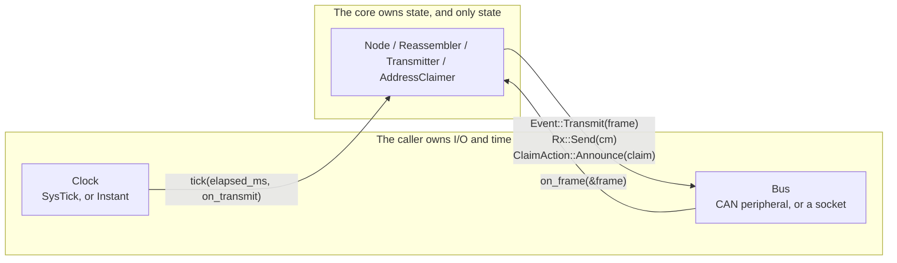
```mermaid
flowchart LR
    subgraph owner["The caller owns I/O and time"]
        clock["Clock<br/>SysTick, or Instant"]
        bus["Bus<br/>CAN peripheral, or a socket"]
    end

    subgraph pure["The core owns state, and only state"]
        sm["Node / Reassembler / Transmitter / AddressClaimer"]
    end

    bus -->|"on_frame(&frame)"| sm
    clock -->|"tick(elapsed_ms, on_transmit)"| sm
    sm -->|"Event::Transmit(frame)<br/>Rx::Send(cm)<br/>ClaimAction::Announce(claim)"| bus
```

The inversion is total. `tick(elapsed_ms, ...)` takes the milliseconds that have
passed as an *argument*, so a test can advance time by exactly `T1 + 1` ms
without waiting; `on_frame(&frame)` takes a frame the caller obtained however it
liked. Where an action must be taken, it comes back as a value —
`Event::Transmit`, `Rx::Send`, `ClaimAction::Announce`, `Tx::SendData` — or, for
`tick`, through an `FnMut(Frame)` callback, because a single tick can expire
several sessions at once and a return value could carry only one.

What this buys, concretely:

- **The same code runs on both targets.** There is no host variant of the
  reassembler and no MCU variant of the claimer. CI proves the core still builds
  for `thumbv7em-none-eabihf` on every push.
- **Tests are deterministic and instant.** `codec_sweep.rs` walks 262,144 PGNs;
  `tp.rs` drives a real `Transmitter` into a real `Reassembler` at every size
  from 9 to 1785 bytes; `ecu_session.rs` runs two whole ECUs through address
  claiming and a three-fault DM1. None of it sleeps, and none of it needs a bus.
- **Timing policy stays with whoever knows it.** BAM pacing is 50–200 ms in
  J1939-21, but on an MCU that means a timer and on a host it means
  `thread::sleep`. `Transmitter` states the requirement,
  `Outgoing::needs_pacing()` reports it, and `Ecu::broadcast` is where the sleep
  actually is.
- **You can adopt part of it.** An application that only wants to decode DM1s
  off a log never constructs a `Node`.

The cost is real and worth naming: the caller must remember to call `tick`. A
`Node` that never ticks never finishes claiming its address and never expires a
stalled transfer. `Ecu` exists largely to make that impossible to forget — every
`poll` ticks — and its `tick` carries the sub-millisecond remainder forward
rather than dropping it, because a loop spinning faster than 1 kHz would
otherwise report zero elapsed time forever and no protocol timer would ever
fire. That was a real bug, and there is a regression test named for it.

---

## 12. Error handling

One error type, `types::Error`, `#[non_exhaustive]`, `Copy`, with a `Display`
that says what actually went wrong. `std::error::Error` is implemented behind
the `std` feature.

| Variant | Raised by |
|---|---|
| `InvalidId(u32)` | `Id::new` — more than 29 bits |
| `InvalidPgn(u32)` | `Pgn::new` — more than 18 bits |
| `InvalidPriority(u8)` | `Priority::new` — above 7 |
| `DestinationMismatch` | `Id::from_parts` — a PDU2 group addressed to one ECU |
| `ShortPayload { expected, actual }` | `Frame::new`, `Request::decode`, `diagnostics::Message::parse`, `identification`, `Dm16`, `on_commanded_address`, `Spn::extract` |
| `InvalidMessageSize(u16)` | `TpCm::bam`/`rts`, `Transmitter::build` — outside 9..=1785 |
| `UnknownControlByte(u8)` | `TpCm::decode` |
| `InvalidDtc` | `Dtc::new` — SPN over 19 bits, FMI over 5, count over 7 |
| `ValueOutOfRange { field, value }` | `memory_access`, `iso11783::ValveNumber::new`, `spn` |

The strategy behind it has three distinct tiers, and which tier a function
belongs to is a design decision, not an accident:

**1. Reject at construction; make later steps infallible.** `Outgoing::new`
builds the `Id` and `Frame` immediately for the single-frame case purely to
validate them, then throws the frame away and stores the payload — so
`next_frame()` cannot fail later. The comment in `next_frame` is explicit that
marking the message sent *before* the (now impossible) fallible calls is
deliberate: treating an impossible failure as "nothing more to send" is better
than hanging a caller that loops until complete.

**2. Make decoding total wherever the wire format allows it.** `TpDt::decode`,
`Dm14::decode`, `Dm15::decode`, `Acknowledgement::decode`, `Name::from_bytes`
and `Lamps::decode` all take a fixed-size array and return a value, not a
`Result` — because every byte pattern *is* a valid message for those groups.
Enums that must round-trip an arbitrary byte carry an escape variant for the
same reason: `AbortReason::Other(u8)`, `AckControl::Other(u8)`,
`MemoryStatus::Other(u8)`, `ValveState::Other(u8)`. Only `TpCm::decode` is
fallible, because an undefined control byte genuinely has no meaning.

**3. Protocol-level failure is a protocol message, not an `Error`.** Refusing a
transfer too large for the buffer is not `Err(...)`, it is
`Rx::Send(TpCm::Abort { reason: ResourcesUnavailable, .. })`. Losing address
arbitration is not an error, it is `ClaimState::CannotClaim` plus a Cannot Claim
broadcast. The `Error` type is for programmer mistakes and malformed input; what
the bus is doing is modelled as state.

At the host boundary, everything becomes `io::Error`: `invalid_input` maps core
errors to `ErrorKind::InvalidInput`, an unanswered handshake becomes
`ErrorKind::TimedOut`, a peer abort becomes `ErrorKind::ConnectionAborted`, and
transmitting without an address becomes `ErrorKind::NotConnected`.

One deliberate non-error deserves highlighting because it is the easiest thing
to misuse: `Ecu::poll` returning `Ok(None)` means "nothing yet", not "nothing
more". It is what a quiet bus looks like. Driving it with
`while let Some(m) = ecu.poll()?` stops at the first gap in traffic; there is a
regression test named for that mistake.

---

## 13. Testing strategy

Five layers, each aimed at a different class of bug.

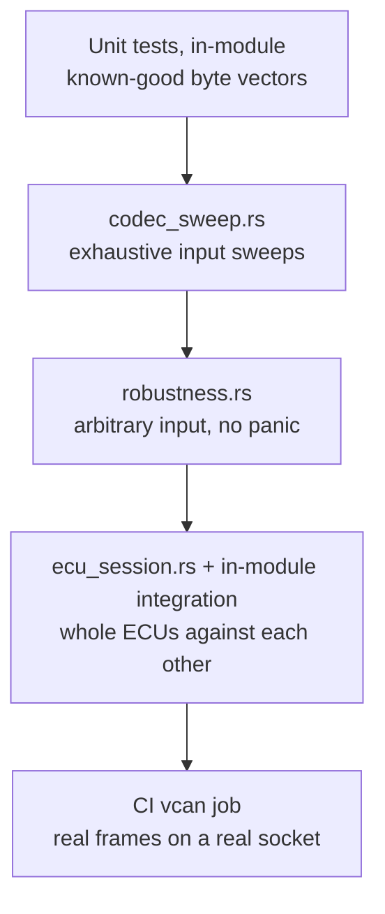
```mermaid
flowchart TD
    u["Unit tests, in-module<br/>known-good byte vectors"] --> s["codec_sweep.rs<br/>exhaustive input sweeps"]
    s --> r["robustness.rs<br/>arbitrary input, no panic"]
    r --> i["ecu_session.rs + in-module integration<br/>whole ECUs against each other"]
    i --> v["CI vcan job<br/>real frames on a real socket"]
```

**Known-good byte vectors, in-module.** Every codec asserts against bytes
derived from the spec layout and cross-checked with the MIT-licensed
Open-SAE-J1939 C reference. The identifier tests are table-driven over
identifiers that reference builds literally — Address Claimed `0x18EEFF80`,
TP.CM `0x1CEC9080`, Request `0x18EA9080`, DM1 `0x18FECA80`, Proprietary A
`0x14EF2380` — and the `name` test reproduces the reference's bit-packing field
by field. The TP.CM control bytes match J1939-21 exactly, down to the `0xFF`
filler positions.

**Exhaustive sweeps (`core/tests/codec_sweep.rs`).** Where the input space is
walkable, it is walked: all 262,144 PGN values, every identifier prefix
(priority × EDP × DP × PF × source), every value of every NAME field with its
neighbours held at a contrasting value, every DTC field, every lamp combination,
every TP.CM variant, all 256 acknowledgement control bytes, the DM14/DM15
byte-1 packing across every count and command, every valve number and state
across all three PGN blocks, and the SPN reserved-range boundary at all 32
supported field widths. It also asserts that NAME arbitration is a strict total
order — otherwise two ECUs could each believe they won. The stated rationale is
that bit-packing bugs hide in the values nobody picks as an example, and this
sweep found one the day it was written.

**No input from the bus may panic (`core/tests/robustness.rs`).** A deterministic
xorshift generator feeds arbitrary bytes to every public decoder, to
`Reassembler`, and to the top-level `Node::on_frame` dispatch — `ROUNDS = 40,000`
across four tests, so 160,000 rounds in total. The tests assert only that
nothing panics, aborts, or overruns; what a decoder *returns* for nonsense is
the module tests' business. The generator is deterministic so any failure
reproduces from its seed. The reasoning in the module doc is worth keeping in
mind when adding a decoder: a panic in a decoder is not a bug report — on an MCU
it is an ECU that stops controlling something.

**The two halves tested against each other.** `Transmitter` drives a real
`Reassembler` across sizes 9, 14, 15, 100, 700 and 1785 bytes and the original
payload comes back out. `Outgoing` drives a real `Node` for a 40-byte broadcast.
A three-code DM1, a DM16 memory read and an ECU identification each make the
same round trip.

**End-to-end sessions (`core/tests/ecu_session.rs`).** Two simulated ECUs on a
shared bus, driven through the public API only — which doubles as a check that
the public surface is usable for building an ECU. They claim distinct addresses
and discover each other; a global request makes both announce themselves; an
unsupported request is answered with a NACK rather than silence; a three-fault
DM1 crosses the bus over BAM and is decoded; a bandwidth-limited sender is never
asked for more packets than its RTS allowed; the receive filter is checked in
both directions; an implement commands a tractor valve and reads the position
back; a displaced ECU reports Cannot Claim.

**CI (`.github/workflows/ci.yml`).** Five jobs:

| Job | What it proves |
|---|---|
| `test` | `cargo test --workspace --all-features` on Linux, with the SocketCAN transport compiled |
| `lint` | `fmt --check`, `clippy --all-targets --all-features -D warnings`, `cargo doc` with `RUSTDOCFLAGS=-D warnings` |
| `no_std` | The core still builds for `thumbv7em-none-eabihf` |
| `msrv` | The core still tests on Rust 1.75 |
| `vcan` | On-bus end-to-end over a virtual CAN interface |

The `vcan` job is the one that catches integration mistakes the pure-Rust tests
cannot. It brings up `vcan0`, runs `examples/vcan_ecu` as a real process, sends
real frames with `cansend`, and greps a `candump` log for the traffic that must
have resulted: `18EEFF80` (the address claim), `1CECFF80` (a BAM announcing the
DM1 response) and `1CEBFF80` (the TP.DT packets carrying it). A second step
checks that `examples/vcan_dump` decodes a live engine frame to
`Engine Speed = 1500.00 rpm`. It is marked `continue-on-error` because the
`vcan` kernel module is not guaranteed on hosted runners, so it is
opportunistic rather than blocking — the authoritative on-bus validation is
`tools/vcan_setup.sh` plus the examples on your own machine.

Warnings are denied per step rather than through a global `RUSTFLAGS`, so a
warning in a third-party dependency cannot fail the build.

---

## Appendix: where to start reading

| If you want to understand… | Read, in order |
|---|---|
| The wire format | `types.rs`, `pgn.rs`, `id.rs`, `frame.rs` |
| Multi-packet messages | `tp.rs` — `TpCm`, then `Reassembler`, then `Transmitter` |
| Network management | `name.rs`, then `address_claim.rs` |
| How it all fits together | `node.rs` — `Outgoing` first, then `Node` |
| Running it on a host | `host/src/bus.rs`, then `host/src/ecu.rs` |
| Running it on an MCU | `core/examples/mcu_node.rs` |
